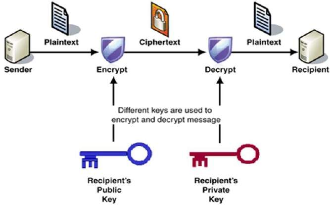
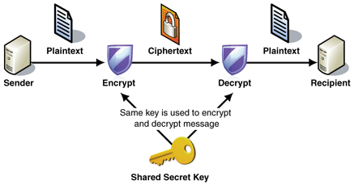

Companies spend lots of money on security especially tech companies where privacy is of utmost importance. They employ several communications security strategy and cryptographic protocols to prevent such from happening. One such method on the web for proofing against these attack is Transport Level Security (TLS).

## What is TLS - An Overview 

Transport Level Security (TLS) is a cryptographic protocol that provides communications security over a computer network. It does this by enforcing privacy and data integrity between two communicating applications on a computer network.  In other to facilitate this, TLS makes use of two types of encryption algorithms and they are asymmetric and symmetric key encryption algorithms. 

In asymmetric key encryption algorithm, the server maintains two keys one **public** and the other **private**. The public key is made available to everyone by the server and private key is kept private. If a message is encrypted using the public key, that message can only be decrypted using the server’s private key. In summary, the client encrypts message using the public key and sends it to the server. The server subsequently decrypts the message using the private key. 

image source https://tutorialspoint.com

In symmetric key encryption, the client and server maintains a shared secret key between them called the symmetric session key which is used both for encryption and decryption. To send a message, the client encrypts the message with this key and upon reaching the server, the same key is used for decryption. 

image source http://alexander.holbreich.org/

In other to transfer the symmetric key initially from the client to the server over a non-secure channel, the server provides its public key to all its clients. The client wanting to connect to the server sends the symmetric shared key information encrypted with the server’s public key to the server. The server sees this shared key information after decrypting the client’s message using its private key. After the server’s agreement on the shared key both start to transfer their data encrypted by the shared symmetric key.  In summary the sequence followed in this method of encryption is: first, the asymmetric key encryption, described earlier, is used only to securely get the symmetric key for a session. Subsequently, the symmetric key encryption is used for all further communications between the client and server. 

Transport Layer Security (TLS), as described above, is normally used to encrypt the TCP container that contains the HTTP or SMTP container (application layer data) of the web service request and response. TLS is effective with web services if the transfer of messages is between two parties only. In scenarios where several intermediate nodes need to access different parts of the content of the same HTTP or SMTP container, however, TLS becomes ineffective and the need arises for a message level security mechanism at the application layer.

## SSL Interception and Rogue Certificates

When you request a website over HTTPS for example https://www.amazon.com your machine will be issued a valid certificate. Your machine then makes the effort to check that it is countersigned by a trusted entity, has a valid signature and that the certificate is not expired or revoked. With SSL interception, an attacker tricks the CA into thinking that are an employee of Amazon so that they can be issued a certificate. This rogue certificate is equivalent to the original one issued by Amazon, and can be used by the attacker to redirect traffic and establish a separate SSL-encrypted connection to the hackers own website. You (the customer) still see a lock icon on your browser since the traffic is encrypted using the right certificate but the attacker still sits in the middle tampering with your traffic. Your web browser won’t complain sinces this certificate is also in your trusted root CA list. 

There are other techniques attackers use to get rogue certificates the above is just one of them. Some common techniques is shown in the below picture 

image source https://www.venafi.com/

## Message Level Security

Message security differs from transport security by encapsulating the security credentials and claims with every message along with any message protection (signing or encryption). Applying the security directly to the message by modifying its content allows the secured message to be self-containing with respect to the security aspects. This enables some scenarios that are not possible when transport security is used. Message level security fits in situation where there are one or more intermediate systems through which message is routed. 

In SOAP specifications, message level security uses the WS-Security specification to secure messages. This specification provides enhancements to SOAP messaging to ensure integrity, confidentiality and authentication at the SOAP message level (instead of the transport level). This is facilitated with the help of XML signatures and XML encryption.  In XML encryption, the entire XML is encrypted including the individual XML tags and each individual tag is encrypted separately with different keys. Encrypting the various part of an XML or JSON document with different keys is what we refer to as message level encryption. 

Although they have been many attempts to implement Message Level Security in REST architectures, but there is no one standard. Some people use JWT signatures some use HTTP headers, others rely on third party service like [Virgil](https://virgilsecurity.com/) Security or the [amazon encryption sdk](https://docs.aws.amazon.com/encryption-sdk/latest/developer-guide/introduction.html).

**A layman explanation of TLS and Message Level Security**

Please watch this video I made that clearly explains TLS and message level security in layman terms. 

`youtube: https://youtu.be/wButjdpGtkk`

## Advantages of Transport Level Security

1. TLS makes a good fit in situations where there are no intermediate systems in the network a good example is the intranet. 
2. It is a protocol inherent security mechanism and as such does not require any coding to be done. 
3. Communicating client do not to understand the WS-Security specification hence allows for intethus allow
4. Allows for interoperability

## Disadvantages of Transport Level Security

1. It is a protocol implemented security mechanism, it only works on point to point. 
2. Being a security mechanism dependent on a protocol it has limited security support and is bounded to the protocol security limitations. 

## Advantages of Message Level Security

1. Since the entire message is secured, intermediaries do not pose a problem. Even if the certificate interception mentioned above occurred, there would be no easy way to decrypt the traffic being logged in the proxy server.
2. It is transport and protocol independent hence very flexible to support a variety of transport option
3. Allows us to support wide range of security options

## Disadvantages of Message Level Security
 
1. There is reduced performance as it requires every individual message to be encrypted, also factoring the time it takes to decrypt and encrypt the message on both ends. 
2. Lacks Interoperability. 
3. For legacy applications, one have to refactor the application as every message is encrypted and signed. This result in a lot of performance issues. Interoperability can also be a problem.

## Code demonstration

[Here](https://github.com/theterminalguy/virgil-rails-chat) is a repo demonstrating Message Level Security in Rails using Virgil Security.
