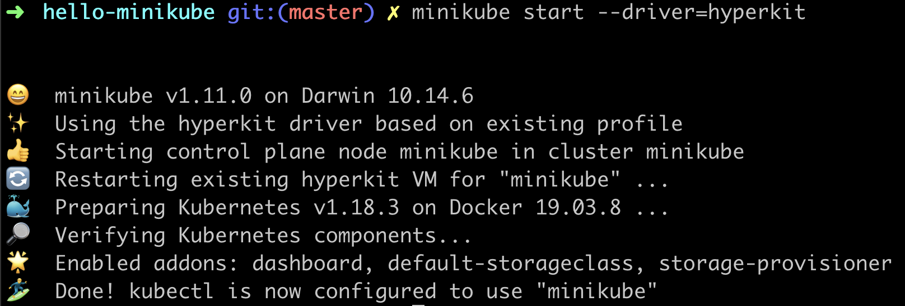

Working with [GKE](https://cloud.google.com/kubernetes-engine) or any managed Kubernetes service can be fun but having to constantly update deployments and pods specifications on a remote host can be both time and resource consuming as your cloud bill could grow astronomically.

What if you could try out Kubernetes locally without having to continually update remote deployments? Enter Minikube.

## What is Minikube?

[Minikube](https://kubernetes.io/docs/setup/learning-environment/minikube/) lets you run Kubernetes locally inside a virtual machine. If you plan to develop with Kubernetes regularly or just want to try it out locally, use minikube.

## What is Hyperkit?

[HyperKit](https://github.com/moby/hyperkit) is an open-source hypervisor for macOS. Hypervisors let you create and run virtual machines. Hyperkit is lightweight and requires no need for third-party kernel extensions. It is also optimized for lightweight virtual machines and container deployment.

Hyperkit will only work on a mac, as it is entirely reliant on [Apple's Hypervisor framework](https://developer.apple.com/documentation/hypervisor). If you are following this tutorial on windows or Linux machine, please consider referring to [this page](https://minikube.sigs.k8s.io/docs/drivers/) for a list of tools to help you create VMs on your platform.

## Installing Minikube 

First, check to see if your OS dsupports virtualization. On a Mac, run the following command on your terminal to confirm

`sysctl -a | grep -E --color 'machdep.cpu.features|VMX'`

If you see VMX appears to be colored in your output, this shows you have virtualization enabled.

Next, install minikube with `brew install minikube`. Please see the [detailed installation guide](https://kubernetes.io/docs/tasks/tools/install-minikube/) if you use a different OS.


## Installing Hyerpkit

First, run the below command to clone and build hyperkit from source

`git clone https://github.com/moby/hyperkit && cd hyperkit && make`

Provided the above runs successfully, you will have the resulting binary in `build/hyperkit`, add that binary to your list of executables using

`mv build/hyperkit /usr/local/bin`

## Start a local K8s cluster with Hyperkit

Create your first local cluster with minikube using the following command

`minikube start --driver=hyperkit`

This will start up minikube using hyperkit as your driver. Feel free to replace hyperkit if you are on a different OS. If all is well, your output should be similar to the screenshot below


<sub>_Minikube running using hyperkit as driver_<sub>

<figure>
	<blockquote>
		<p>Kubernetes is also called K8s derived from the acronym (K-eight characters - S)</p>
	</blockquote>
</figure>

## Putting it all together

Lets run our first docker container in our local K8s cluster on minikube. We will be using the sample hello-app docker image from the [Google container registry](https://console.cloud.google.com/gcr/images/google-samples/GLOBAL/hello-app?gcrImageListsize=30). This is image prints hello world using the go programming language. You can find the complete source code [here](https://github.com/GoogleCloudPlatform/kubernetes-engine-samples/tree/master/hello-app)

First, create a deployment using the image. This deploys your container to a pod on the local cluster.

```
kubectl create deployment hello-minikube --image=gcr.io/google-samples/hello-app:1.0
```

Next, create a service which will expose the above deployment outside of the local cluster.

```
kubectl expose deployment hello-minikube --type=NodePort --port=8080
```

Finally, view your app using the command below. This should by default open the app in a web browser.

```
minikube service hello-minikube
```

After you run the above command you should see an output similar to this in your terminal. You can also visit the url in the table to see the running container

```
| NAMESPACE | NAME | TARGET PORT    | URL                       |
|-----------|------|----------------|---------------------------|
| default   |      | hello-minikube | http://<YOUR_IP>:<YOUR_PORT> |
```

## Wrapping it up

Proceed with deleting all created resources in your cluster.

Delete all K8s objects

```
kubectl delete service hello-minikube
kubectl delete deployment hello-minikube
```

Stop and delete the minikube vm

```
minikube stop
minikube delete
```

Thanks for reading