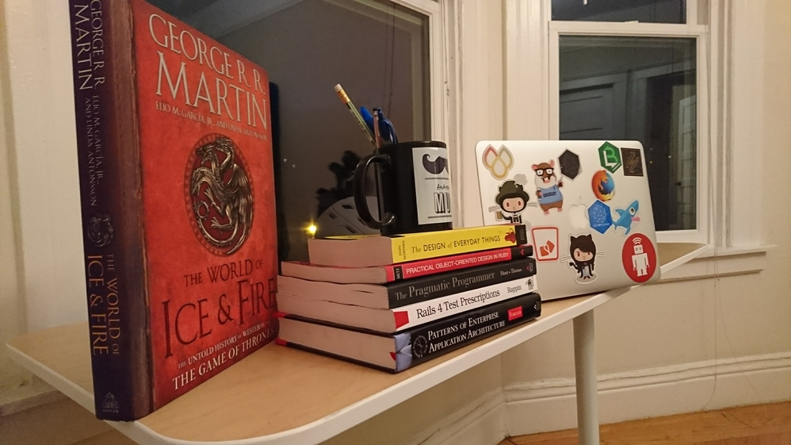

Hi, I am Damian Simon Peter. Maker and builder of things. I have spent the past years working for early-stage startups, building backend and frontend applications primarily using Ruby and JavaScript. Most of my tinkering is done on a [System76 Galago Pro](https://system76.com/laptops/galago) running [Pop!_OS](https://system76.com/pop).

## Experience

I started tinkering with computers in the summer of 2009, after which I decided to pursue a career in Networking. Shortly after spending a year working as an intern Network engineer with a company in Lagos, I discovered Visual Basic 6 and fell in love with it. I spent the next two years building desktop applications on Windows using VB6 as a freelancer. [Dreamincode.net](https://www.dreamincode.net/) was my then StackOverflow all help I could get was sourced from devs on the forum. Then came my discovery of classic ASP and IIS, then PHP and Apache. After a while, I got bored with the web and wanted to build for mobile using the same web technologies. I later stumbled upon Apache Cordova and ionic/Angular framework which I used to build mobile apps for iOS and Android on the intel SDK.

In 2014, I heard about Node.js and was super excited. What got me excited was the idea of having a universal language (JavaScript) for cross-platform development. Since I already used JavaScript on the web and for mobile development, thoughts of using it as a server-side language were intriguing. In late 2015, I joined an outsourcing company where I got introduced to Ruby, Rails, React, and Backbonejs. I spent the last four years working primarily with RubyOnRails with a little bit of elixir. My full-time job currently involves writing lots of PHP, Ruby, JavaScript, and recently, go lang code.

*Books purchased on Amazon - 37.764640, -122.427937, San Francisco, 2017*

## What am I reading now ?

1. Wriing and interpreter in Go 
2. The Hidden Language of Compuer Hardware and Software
3. Operating Systems Three Easy Pieces 
4. The Elements of Computing Systems 

Thanks for stopping by 